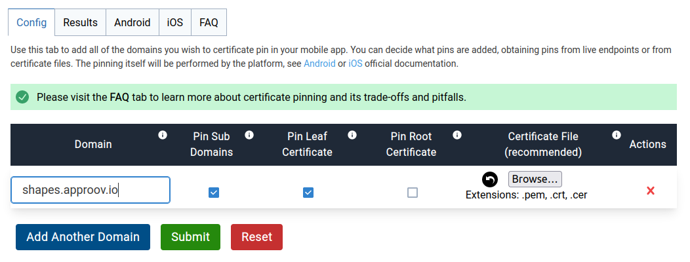

# Pin Test App: Android Mobile Certificate Pinning Generator

This repo provides the basic steps for integrating certificate pinning into your mobile app with the use of this [Approov free tool](https://approov.io/tools/static-pinning). This guide is written specifically for native Android apps from API 24 (Android 7.0) onwards that you wish to protect the API calls with certificate pinning.

To follow this guide you only need to have an Android development setup on your machine.

## TOC

* [Certificate Pinning](#certificate-pinning)
* [Hands on Example](#a-hands-on-example)


## Certificate Pinning

Certificate pinning is a mechanism to ensure a connection to a particular domain is only made if a specific TLS certificate is present in the chain presented. Specifically, public key pinning is performed that ensures a certificate is associated with a particular public key hash. It is possible to update certificates without changing their public key.

The pinning is implemented using the platform provided mechanism in the network security configuration, as discussed [here](https://developer.android.com/training/articles/security-config#CertificatePinning). The tool generates the required format for `network-security-config.xml` file.

Whenever the app needs to establish a connection with the server hosting that domain name, and for this to happen, a TLS handshake takes place in order that both parties can exchange messages and establish the encryption algorithms to use, and to set the session keys to be used thereafter. During the TLS handshake, when the device receives the server certificate, it only establishes the connection if it trusts a specific certificate in the presented chain, hence it is said that the connection is pinned.

Please visit the FAQ tab on [this page](https://approov.io/tools/static-pinning) to learn more about certificate pinning and the associated trade-offs and pitfalls.

[TOC](#toc)


## A Hands On Example

We will use the Pin Test app included in this repo to illustrate how we can add the certificate pinning configuration.

### The Setup

First, clone the this repo with:

```bash
git clone https://github.com/approov/example-android-static-certificate-pinning.git
```

Now build the app and launch it on an emulator or real device and click the `Say Hello` button and a happy green face should be seen on the screen:


Initially the app does not use certificate pinning.


### The Mobile Certificate Pinning Configuration

Let's use the [Approov free tool](https://approov.io/tools/static-pinning) to generate a certificate pinning configuration for the domain used to make API calls in the mobile app, `shapes.approov.io`:



After you type the `shapes.approov.io` domain you need to click the submit button and if everything goes well you will land in the results tab:


Now open the Android tab:


Click on the `Copy` button to copy the certificate pinning XML configuration to your clipboard to use in the next step in the `network_security_config.xml` file.


### The Android Network Security Configuration

First, create the `network_security_config.xml` file:

```bash
mkdir -p ./pin-test-app/app/src/main/res/xml
touch ./pin-test-app/app/src/main/res/xml/network_security_config.xml
```

Now paste the certificate pinning configuration from your clipboard into the `./pin-test-app/app/src/main/res/xml/network_security_config.xml` file.

Finally, open the `./pin-test-app/app/src/main/AndroidManifest.xml` file and inside the `application` tag add the following:

```xml
<application android:networkSecurityConfig="@xml/network_security_config"/>

```

The files should look like this:


### Mobile Certificate Pinning in Action

We will test that certificate pinning is working as expected when the correct certificate is presented during the TLS handshake, and connection is blocked when the pin differs from that expected.

#### Testing that the App Continues to Work

Rebuild the Pin Test app and click the `Say Hello` button and double-check you can get a green smile, like this one:


The successful response means that the pin extracted from one of the certificates in the chain presented during the TLS handshake matches the one defined in the network security config file.

#### Testing the App Doesn't Work on Certificate Pinning Mismatch

Edit the `./main/res/xml/network_security_config.xml` file and change one or more digits in the pin digest in order to simulate a certificate pinning failure.

A certificate pinning failure occurs usually due to a MitM attack, due to a change in the TLS certificates of the API backend or due to a firewall (usually used in corporate environments) on the network used by the mobile app.

The certificate pinning failure will occur when the mobile app tries to make an API request and during the TLS handshake is not able to match the pin in the network security config file with the pin extracted from the certificate presented by the API backend.

Let's see this in practice. Rebuild the Pin Test app again and click the `Say Hello` button and this time you will get an unhappy red face, like this one:


So, as the message says the pin verification failed, therefore the API request wasn't made, because the pin in the network security file doesn't match the one extracted from the TLS certificate presented during the TLS handshake with the API backend.

Finally, undo the changes you made to the pin, rebuild the mobile app and ensure that you get again your happy green smile.

Note that we have simulated a pin mismatch by changing what is expected by the app, rather than changing what is presented by the server. You can cause a server side change by using the correctly pinned version of the app and then follow the instructions to perform a MitM on the app traffic using [mitmproxy](https://mitmproxy.org/), [BurpSuite](https://portswigger.net/burp), [HTTP Tooklit](https://httptoolkit.tech/), [Charles Proxy](https://www.charlesproxy.com/) or something else equivalent. For example, you can follow the article [How to MitM Attack the API of an Android App](https://blog.approov.io/how-to-mitm-attack-the-api-of-an-android-app) to learn how to do it with mitmproxy.

[TOC](#toc)
